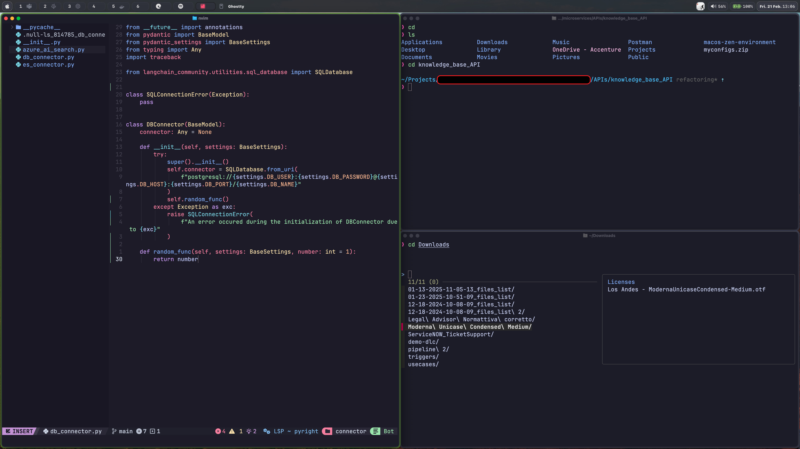

# macos-zen-environment
My personal work configuration, comprising Aerospace, ZSH, powerlevel10k, zoxide, fzf, NVIM, and so on.

__This work is primarly based on YouTube tutorials, from various awesome content creators, such as:__
- Dreams of Autonomy
- DevOps Toolbox
- ThePrimeagen
- typecraft

I hope this is a nice setup you can adopt and that I can save you some time in configurations.

## Aerospace

